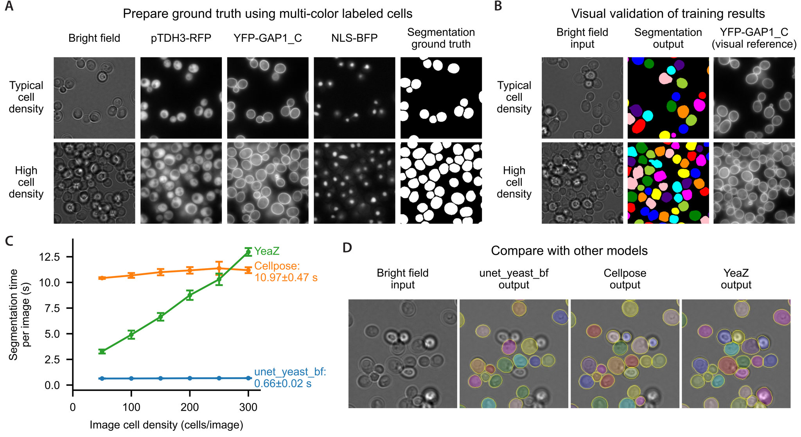

# Yeast Cell Segmentation Model: unet_yeast_bf

This repository contains a U-Net model for segmenting yeast cells from bright-field microscopy images.

## Model description

This model was fine-tuned from the pretrained U-Net model **2d_cell_net_v0** from Falk et al. (2019), *U-Net: Deep learning for cell counting, detection, and morphometry*. *Nature Methods* **16**, 67–70.

Fine-tuning was performed using images acquired on a Nikon Ti-E microscopy system equipped with a 60× objective and a Hamamatsu ORCA-R2 CCD camera. The images have a pixel size of 0.107 µm.

To generate accurate ground-truth annotations, genetically encoded fluorescent markers were used to label cellular structures. Whole cells were labeled with RFP, nuclei were labeled with BFP, and the plasma membrane was labeled with YFP. Initial segmentation masks were generated using classical image-processing methods and subsequently manually curated to remove out-of-focus cells and separate contacting cells.

Training data included both typical cell-density images and crowded fields containing out-of-focus cells above the focal plane. As a result, the model can reliably identify in-focus cells even in densely populated images.

For low-resolution images acquired with 2×2 binning, images are upscaled by a factor of two before segmentation, and the resulting segmentation masks are downscaled back to the original resolution.

The model was trained to explicitly identify boundaries between contacting cells, eliminating the need for additional post-processing to separate adjacent cells. To remove low-confidence detections, the mean U-Net segmentation score is calculated for each connected region, and regions with an average score below 0.95 are discarded.

This minimal post-processing pipeline makes the model faster than several alternative methods we evaluated while remaining effective at excluding out-of-focus cells and robust to morphological variation, including elongated cell shapes.

Representative training images, evaluation images, and benchmark results (with a single NVIDIA GTX 1070 GPU) are shown below:



## Weights

Model weights are available at:

https://huggingface.co/angli339/unet_yeast_bf

## Usage

```python
import unet_yeast_bf
from tifffile import imread

model = unet_yeast_bf.UNet()

im = imread('sample_images/typical_density.tif')
score, labels = model.segment_and_label(im)
```

Alternatively, see [notebooks/demo.ipynb](notebooks/demo.ipynb) for example code demonstrating how to load from TensorFlow SavedModel format and run inference.

## Limitations

This model was developed specifically for bright-field yeast images acquired under the imaging conditions described above. Its performance has not been systematically evaluated on images acquired with different pixel sizes, microscope configurations, or imaging modalities.

The model and weights are provided as-is for transparency and reproducibility purposes.

## Citation

If you use this model or find it useful in your work, please cite:

* Li, A. and Springer, M. (2026). *Glucose repression of HXK1 is glucose flux-dependent via non-canonical regulation of Mig1*. *bioRxiv*.